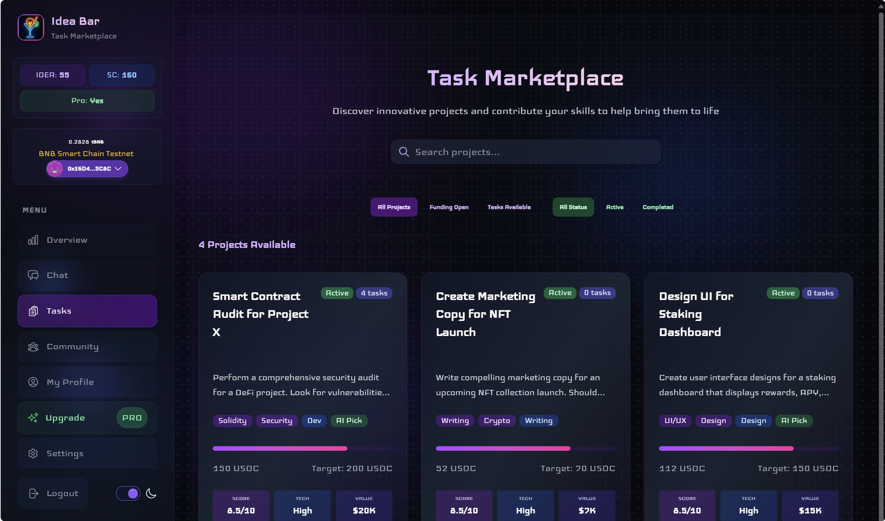
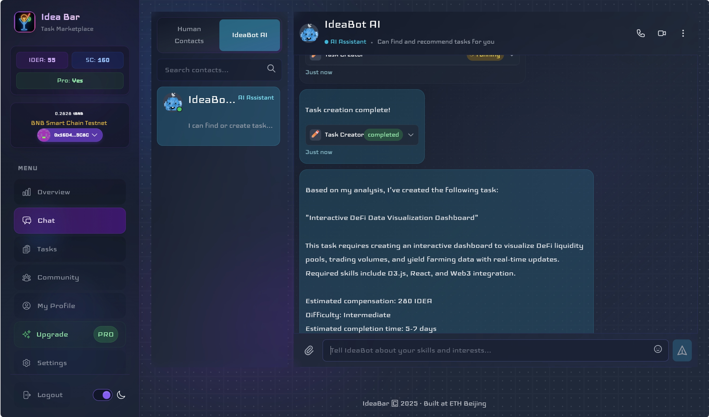

# 🍸 Idea Bar

<h4 align="center">
  AI-Powered Decentralized Creative Task Platform
</h4>

## 🚀 Overview

Idea Bar is a revolutionary next-generation content and value creation ecosystem. The platform's core mechanism leverages artificial intelligence (AI) to accurately predict market potential demands and break them down into executable tasks. Through an intelligent matching system, these tasks are connected with users (especially creators aspiring to become "super individuals") who possess the relevant skills and interests.

Upon task completion, the results are minted as NFTs (ensuring ownership rights and transparency), with high-quality works having the opportunity to be automatically reposted through the platform's official social media (such as X platform), thereby amplifying personal influence. Idea Bar adopts a unique dual-track token economic model (platform token IDEA and personal token SoulCoin) to incentivize users' creation, participation, and growth. 

By integrating cutting-edge Web3 technologies such as EIP-7702, the platform is committed to lowering user participation barriers (such as Gas fee sponsorship) and optimizing core economic interactions (such as automatic subscriptions), providing users with a smooth and efficient experience, ultimately empowering global creators to maximize their personal value in the AI era.

<div align="center">
  
  <br /><br />
  
</div>

## 🔍 Background & Positioning

### Background

- **Rise of Individuals in the AI Era**: AI technology is empowering individuals with unprecedented productivity, innovation, and adaptability. "Super individuals" - those who can efficiently use AI to independently complete complex work and achieve diverse monetization - are becoming a trend.

- **Popularization of Side Jobs and Gig Economy**: AI has significantly lowered the barriers in content creation and skill services, opening up new side job opportunities and possibilities for "zero-cost entrepreneurship."

- **Maturation of Web3 Technology**: Blockchain technology provides a solid foundation for digital asset ownership, transparent value circulation, and decentralized collaboration.

### Pain Points Addressed

- **Limitations of Traditional Freelance Platforms**: Existing platforms are mostly demand-driven, putting creators in a passive order-taking state, making it difficult to exercise initiative and predictive creativity.

- **Insufficient Individual Value Discovery and Amplification**: Excellent individual creators often lack effective discovery channels and influence amplification mechanisms for their achievements and abilities.

- **High Web3 Application Barriers**: Factors such as Gas fees and complex wallet operations hinder the entry of non-crypto-native users.

- **Limited Personal Brand and Career Development Autonomy**: Creators struggle to fully control their career development paths and long-term personal brand building.

### Positioning

Idea Bar positions itself as a next-generation content and value creation platform that empowers everyone to become a "super individual." We are not just a task distribution system, but a decentralized ecosystem integrating AI empowerment, skill matching, value realization, personal brand building, and career growth, serving those who eagerly embrace the AI wave and seek breakthroughs in personal capabilities and autonomy in career development.

## 💡 Solution

Idea Bar addresses the above pain points through these core mechanisms:

### AI-Driven Demand Prediction and Task Generation
The platform's AI system ("IdeaBot") continuously analyzes multi-dimensional data (such as social media trends, industry reports, on-chain activities), proactively predicts potential market demands and emerging opportunities, and intelligently breaks them down into specific, executable creative tasks or service needs.

### Personalized Capability Profile (MCP) and Smart Matching
Building a dynamic "My Capability Profile" for each user, combining their skill tags, historical achievements, interest preferences, and on-chain reputation. The AI precisely matches generated tasks to the most suitable users based on MCP, achieving the reverse thinking of "tasks finding people."

### On-Chain Results and Value Marketization
Task results completed by users are minted as NFTs, ensuring creators' clear ownership of their digital works. These results can be displayed, traded, and discovered by future demanders in the platform's built-in open market, realizing value monetization.

### Dual-Track Token Incentives and Reputation System

- **Platform Token (IDEA)**: Used for platform transactions, task rewards, service subscriptions, and governance voting, maintaining value through deflationary mechanisms.

- **Personal Token (SoulCoin)**: Each user's exclusive token, representing their personal reputation, skill value, and service capability. Others can obtain services or express support by purchasing or earning SoulCoin, directly linking its value to the creator's influence and quality of output.

### Social Amplification and Influence Building
The platform automatically identifies and promotes high-quality user results, such as reposting through the official X account, and encourages including calls to action (CTA) for the creator's personal token (SoulCoin) in reposts, helping creators quickly accumulate personal brand and community influence.

### EIP-7702 and Other Technologies Optimizing User Experience
Significantly lowering the threshold for new user participation through Gas fee sponsorship mechanisms; simplifying subscription service processes through automatic payment functions, providing a smooth experience close to Web2 applications.

### AI-Assisted Growth and Collaboration
The platform AI not only recommends tasks but also provides personalized learning resource suggestions, assisting users in improving skills, adapting to the requirements of the AI era, and even exploring new models of human-machine collaboration.

## ⚙️ Technical Implementation

- **AI Demand Prediction and Task Decomposition**: Utilizing technologies based on large language models (LLM), machine learning, and natural language processing (NLP) to analyze massive unstructured and structured data, identify patterns, predict trends, and use knowledge graphs to break down macro demands into micro tasks.

- **Intelligent Matching Algorithm**: Employing recommendation system principles such as collaborative filtering, graph neural networks, or reinforcement learning, combined with user profiles (MCP) and task characteristics, to achieve efficient and precise task-user matching.

- **Blockchain and Smart Contracts**: Choosing high-performance, low-cost blockchain networks (such as L2 solutions), implementing task publishing, NFT minting, token issuance and circulation, decentralized governance (DAO), and EIP-7702-related Gas fee sponsorship and authorized payment logic through smart contracts.

- **Decentralized Storage**: Storing user result source files (such as design drafts, code, articles) on decentralized storage networks like IPFS, ensuring data persistence and censorship resistance.

- **Social Media Integration API**: Connecting with social media platforms like X through official API interfaces to achieve automated content publishing and interaction data analysis.

## 🌟 Innovative Highlights

- **AI-Driven Reverse Task Generation**: From "people finding jobs" to "jobs (AI-predicted) finding people," overturning traditional supply and demand models and stimulating creators' potential.

- **Empowering "Super Individuals"**: Platform mechanisms deeply align with the trend of individual rise in the AI era, providing tools, opportunities, and incentives to help users become highly efficient independent creators.

- **Unique Dual-Track Token Economy**: Combining platform tokens and personal tokens, both ensuring platform economic circulation and highlighting individual value and brand, forming a powerful incentive loop.

- **Innovative Application of EIP-7702**: Greatly optimizing Web3 user experience, lowering barriers through Gas sponsorship and automatic subscriptions, attracting a broader user base.

- **Social Influence Amplification Mechanism**: Connecting internal value creation with external social media influence, accelerating personal brand building.

- **Next-Generation Content Creation Platform Concept**: Not only focusing on the creation of content itself but also on creators' intellectual property protection, career development autonomy, and value realization.

## 🔮 Application Scenarios & Target Users

### Application Scenarios

- **AI-Assisted Content Creation**: Article writing, script generation, marketing copy, novel creation, etc.

- **AI-Assisted Design and Creativity**: Logo design, poster production, UI/UX prototyping, short video material generation, etc.

- **AI Skill Services and Consulting**: AI tool training, AI application consulting, AI model fine-tuning, data analysis and visualization, etc.

- **Programming and Development Tasks**: Small project development, code snippet writing, smart contract-assisted writing, technical tutorial writing, etc.

- **Knowledge Payment and Community Operations**: Creating paid content based on professional skills or interests, operating paid communities, etc.

### Target Users

- Freelancers, designers, writers, developers, etc., eager to use AI to improve efficiency and creativity.

- Individuals seeking side job opportunities and diversified income sources.

- Early adopters and potential "super individuals" hoping to explore personal brand building and value realization in the Web3 field.

- Students, researchers, and innovators interested in AI technology and decentralized collaboration models.

## 🗓️ Future Plans & Vision

### Near-Term Plans (MVP and Early Ecosystem Building)

- Launch MVP version with core functionalities, focusing on validating AI task generation and matching, basic dual-track token model, EIP-7702 experience optimization, and X reposting mechanism.

- Attract initial seed users through community cooperation and content incentives, accumulate early data, and iterate to optimize AI models and platform features.

- Establish a preliminary DAO governance framework.

### Mid-Term Plans (Ecosystem Expansion and Functionality Deepening)

- Expand AI capabilities to support more complex task decomposition and human-machine collaboration models (such as AI Agent-assisted task completion).

- Enrich the application scenarios of personal tokens (SoulCoin) and introduce more complex financial mechanisms (such as staking and lending).

- Expand cooperation with other Web3 projects and real-world enterprises to introduce more diverse task sources and demand sides.

- Improve DAO governance mechanisms to achieve deeper community co-building and co-governance.

### Long-Term Vision

Idea Bar is committed to becoming the leading infrastructure empowering individual rise in the AI era and a next-generation content and value co-creation ecosystem that nurtures and serves global "super individuals." We expect to build a prosperous network where millions of "super individuals" are active, producing massive high-value creative results daily. Through continuous technological innovation and ecosystem building, Idea Bar will be not just a platform, but a new way of working and value realization paradigm, leading the future of the individual economy, allowing everyone to independently control their career destiny and shine uniquely in the waves of AI and Web3.

## 🧰 Built with Scaffold-ETH 2

This project is built using [Scaffold-ETH 2](https://github.com/scaffold-eth/scaffold-eth-2) - an open-source toolkit for building decentralized applications on Ethereum.

- NextJS
- RainbowKit
- Foundry
- Wagmi
- Viem
- TypeScript

## 🚀 Getting Started

### Requirements

- [Node (>= v20.18.3)](https://nodejs.org/en/download/)
- Yarn ([v1](https://classic.yarnpkg.com/en/docs/install/) or [v2+](https://yarnpkg.com/getting-started/install))
- [Git](https://git-scm.com/downloads)

### Quick Start

1. Install dependencies:

```bash
yarn install
```

2. Run a local network:

```bash
yarn chain
```

3. Deploy the contracts:

```bash
yarn deploy
```

4. Start the frontend:

```bash
yarn start
```

Visit your app on: `http://localhost:3000`